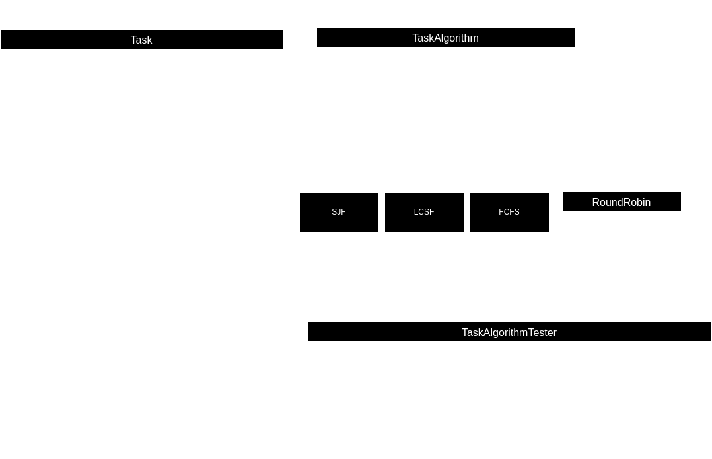
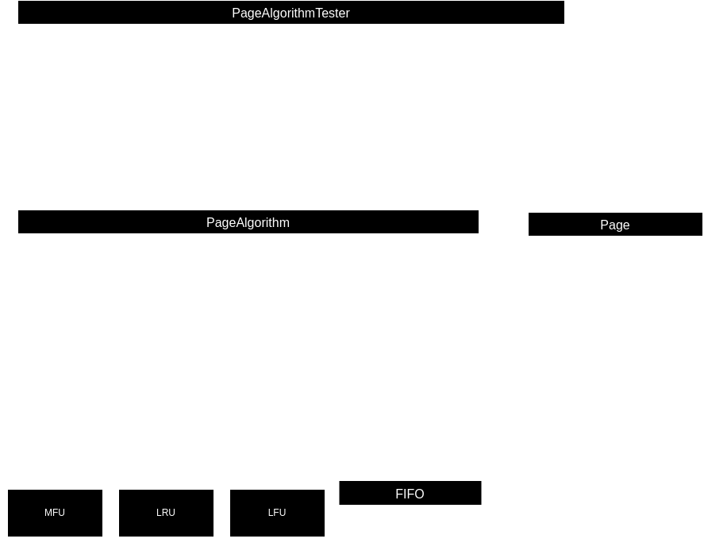
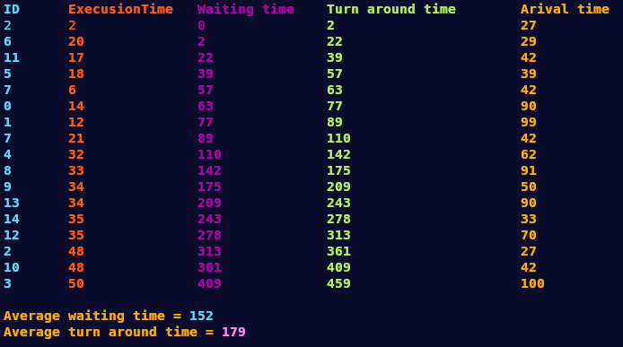
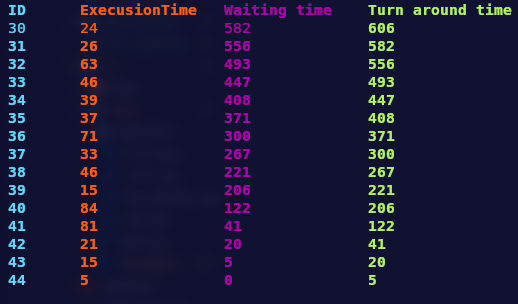
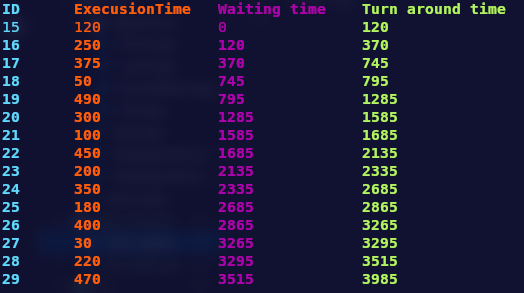
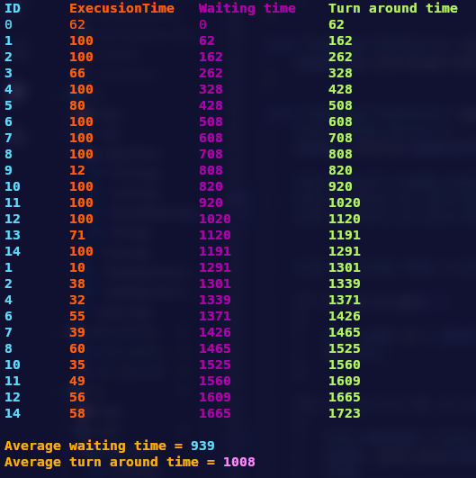
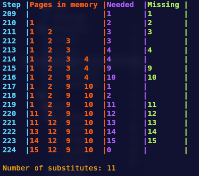

# Programy Symulacyjne - Sprawozdanie

Program symulacyjny ma na celu symulację działania wybranych algorytmów planowania czasu procesora oraz algorytmów zastępowania stron. Program ten pozwala użytkownikowi na porównanie wydajności i efektywności różnych podejść do zarządzania zasobami w systemach operacyjnych.

## Użyte technologie

<div align="center">
	
	
</div>

## Uruchomienie programu

Program został napisany w języku C++17 i do jego kompilacji wymaga użycia narzędzia CMake. Został przetestowany wyłącznie na systemach operacyjnych z Linuxem.

### Kompilacja

Aby skompilować program należy wprowadzić następujące komendy z poziomu katalogu projektu:

```bash
	mkdir build
	cd build
	cmake ..
	make
```

### Start symulacji

Po kompilacji projektu należy uruchomić program utwożony w katalogu `build` o nazwie `simulations`.

## Dokumentacja kodu

### Main

Plik `main.cpp` jest wykorzystywany do przekazania klasą `TaskAlgorithmTester` i `PageAlgorithmTester` odpowiednich parametrów, które można zmienić na potrzeby symulacji.
Plik ten implementuje też wybór odpowiedniego algorytmu.
11

### Tasks
---
<div align="center">
	
</div>

---

1. *Task Algorithm* - jest to klasa czysto wirtualna po której dziedziczą wszystkie algorytmy przydzielania pracy procesora do zadań.
2. *Task* - klasa mająca reprezentowć zadanie przydzielonw procesorowi.
3. *Task Algorithm Tester* - klasa odpowiedzialna za wytworzenie losowych lub wczytanie z pliku zadań przekazywanych do odpowiedniego algorytmu.
4. **Algorytmy** - wszystkie algorytmy są zaimplementowane w klasie o takiej samej nazwie i dziedziczą po interfejsie *TaskAlgorithm*. Implementacja algorytmu znajduje się w funkcji `startAlgorithm()`.
	- **SJF** (*Shortest-Jobtime-First*) - algorytm wykonujący najpierw zadania o najkrótszym czasie wykonywania.
	- **FCFS** (*First-Come, First-Served*) - algorytm wykonujący najpierw zadania, które dotarły do procesora najwcześniej.
	- **LCSF** (*Last-Come, Served-First*) - algorytm wykonujący najpierw zadania, które dotarły do procesora najpóźniej.
	- **Round Robin** - algorytm przydzielający kolejno określony czas (`quantum_`) każdemu zadaniu, a jeśli zadanie nie zostanie wykonane w tym czasie, zostaje przesunięte na koniec kolejki.


### Pages
---
<div align="center">
	
</div>

---

1. *Page Algorithm* - jest to klasa czysto wirtualna po której dziedziczą wszystkie algorytmy wczytywania stron do pamięci.
2. *Page* - klasa mająca reprezentowć stronę w pamięci komputera.
3. *Page Algorithm Tester* - klasa odpowiedzialna za wytworzenie losowych lub wczytanie z pliku stron przekazywanych do odpowiedniego algorytmu.
4. **Algorytmy** - wszystkie algorytmy są zaimplementowane w klasie o takiej samej nazwie i dziedziczą po interfejsie *PageAlgorithm*. Implementacja algorytmu znajduje się w funkcji `startAlgorithm()`.
	- **MFU** (*Most Frequently Used*) - zastępuje stronę w pamięci do której było najwięcej odsłon.
	- **LFU** (*Least Frequently Used*) - zastępuje stronę w pamięci do której było najmniej odsłon.
	- **LRU** (*Least Recently Used*) - zastępuje stronę w pamięci która była używana najdawniej.
	- **FIFO** (*First In First Out*) - zastępuje stronę w pamięci która była dodana najdawniej.

## Algorytmu i ich testy

Każdy z algorytmów ma swoje mocne i słabe strony w różnych przypadkach testowych. W przypadku powyższych algorytmów złożoność obliczeniowa nie zależy w dużym stopniu od ilości danych, lecz od kolejności potrzebnych stron w pamięci lub przychodzących zadań do procesora. Dlatego też wszystkie algorytmy będą porównywane na zbiorach danych zawierających 15 elementów, ale o różnej kolejności.


### SJF Wywłaszczający (*Shortest-Jobtime-First*)

Algorytm ten "faworyzuje" zadania o krótkim czasie wykonywania, co zapobiega sytuacjom, w których długotrwałe zadanie blokuje realizację mniejszych zadań. Optymalizuje on także kolejkę wykonywanych zadań szybko wykonują na początku najkrótsze zadania przezco kolejka bardzo szybko maleje. Wadą tego podejścia jest jednak to, że zadania o długim czasie wykonania mogą być blokowane. Wybór tego algorytmu jest rozsądny, jeśli w naszym przypadku zadania o krótkim czasie wykonania mają wyższy priorytet i nie napływają ciągle do procesora.

<div align="center">
	<h4>Optymalne działanie algorytmu</h4>
	
	<h4>Dane</h4>
</div>

|Zadanie|0|1|2|3|4|5|6|7|8|9|10|11|12|13|14|
|---|---|---|---|---|---|---|---|---|---|---|---|---|---|---|---|
|Czas wykonywania|14|12|50|50|32|18|20|27|33|34|48|17|35|34|35|
|Czas przybycia|90|99|27|100|62|39|29|42|91|50|42|42|70|90|33|

<div align="center">
	<h4>Porównanie wyników</h4>
</div>

|Dane|SJF|LCSF|FCFS|Round Robin|
|---|---|---|---|---|
|Średni czas oczekiwania|152|225|203|203|
|Średni czas zakończenia|179|225|233|233|

### LCSF (*Last-Come, Served-First*)

Algorytm LCSF jest metodą zarządzania kolejką procesów, w której najnowszy proces, który wszedł do kolejki, jest przetwarzany jako pierwszy. Procesy są umieszczane na początku stosu i przetwarzane w odwrotnej kolejności ich przybycia. Pozwala to na szybką odpowiedź na nowe rządania jednak posiada również wadę jaką jest blokowanie starszych procesów jeżeli nowe procesy nadchodzą nieustannie.


<div align="center">
	<h4>działanie algorytmu</h4>
	
	<h4>Dane</h4>
</div>

|Zadanie|1|2|3|4|5|6|7|8|9|10|11|12|13|14|15|
|---|---|---|---|---|---|---|---|---|---|---|---|---|---|---|---|
|Czas wykonywania|120|250|50|375|490|300|100|450|200|350|180|400|30|220|470|


<div align="center">
	<h4>Porównanie wyników</h4>
</div>

|Dane|SJF|LCSF|FCFS|Round Robin|
|---|---|---|---|---|
|Średni czas oczekiwania|1079|1940|1778|1995|
|Średni czas zakończenia|1314|2206|2044|2084|

### FCFS (*First-Come, First-Served*)

Algorytm FCFS jest metodą zarządzania kolejką procesów, w której najnowszy proces, który wszedł do kolejki, jest przetwarzany jako ostatni. Procesy są umieszczane na początku stosu i przetwarzane w  kolejności ich przybycia. Pozwala to na wtkonywanie poleceń zgodnie z ich kolejnością i nie istnieje ryzyko zagłodzenia procesów. Jest to również najprostrzy do zaimplementowania algrytm ponieważ opiera się on na kolejce FIFO.


<div align="center">
	<h4>działanie algorytmu</h4>
	
	<h4>Dane</h4>
</div>

|Zadanie|1|2|3|4|5|6|7|8|9|10|11|12|13|14|15|
|---|---|---|---|---|---|---|---|---|---|---|---|---|---|---|---|
|Czas wykonywania|120|250|50|375|490|300|100|450|200|350|180|400|30|220|470|


<div align="center">
	<h4>Porównanie wyników</h4>
</div>

|Dane|SJF|LCSF|FCFS|Round Robin|
|---|---|---|---|---|
|Średni czas oczekiwania|1079|1940|1778|1995|
|Średni czas zakończenia|1314|2206|2044|2084|


### Round Robin

Algorytm Round Robin jest metodą zarządzania kolejką procesów, w której każde z zadań kolejno ma przypisany maksymalny czas wykonywania. Jeżeli dane zadanie nie skończy się w tym czasie jest ono wywłaszczane i przenoszone na koniec kolejki. Mechanizm ten działa podobnie do SJF ponieważ najkrutsze procesy pierwsze opuszczą kolejkę jednak nie powoduje to zagłodzenia dłużej wykonywanych zadań.

<div align="center">
	<h4>działanie algorytmu</h4>
	
	<h4>Dane (quantum = 100)</h4>
</div>

|Zadanie|1|2|3|4|5|6|7|8|9|10|11|12|13|14|15|
|---|---|---|---|---|---|---|---|---|---|---|---|---|---|---|---|
|Czas wykonywania|120|110|138|66|132|80|155|139|160|12|135|149|156|71|158|


<div align="center">
	<h4>Porównanie wyników</h4>
</div>

|Dane|SJF|LCSF|FCFS|Round Robin|
|---|---|---|---|---|
|Średni czas oczekiwania|556|853|754|939|
|Średni czas zakończenia|658|968|869|1008|


## MFU (*Most Frequently Used*)

Jest to algrortm zastępowania stron, który jako pierwszą zastępuje stronę do której było najwięcej odsłon. Algorytm ten działa najlepiej kiedy strony potrzebne w pamięci są nie zmieniają się zbyt często i przychodzą do pamięci grupami. Wadą tego podejścia jest pojawienie się pamięci która jest często używana w pamięci przez czały czas, gdyż to ona będzie z niej pryjoretowo usuwana.

<div align="center">
	<h4>działanie algorytmu</h4>
	
	<h4>Dane</h4>
</div>

|Strony|1|2|3|3|4|4|5|10|1|2|11|12|13|14|15|
|---|---|---|---|---|---|---|---|---|---|---|---|---|---|---|---|

<div align="center">
	<h4>Porównanie wyników</h4>
</div>

|Dane|FIFO|LRU|LFU|MFU|
|---|---|---|---|---|
|Liczba podmian stron|13|13|12|11|

